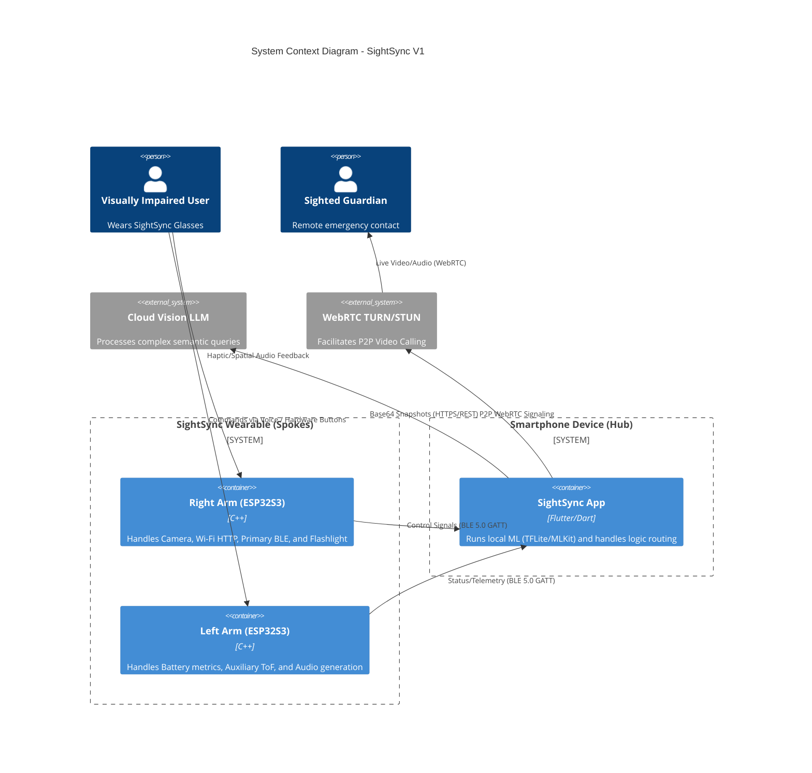
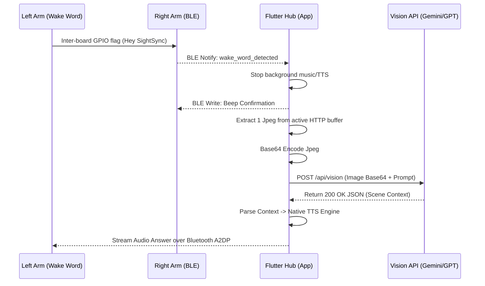

# Software Design Specification (SDS)
## Project: SightSync
**Author:** Pal Gandhi  
**Date:** March 2026  
**Document Version:** 2.0 (Enterprise Standard)  

---

## Table of Contents
1. [Introduction](#1-introduction)
2. [Macro System Architecture](#2-macro-system-architecture)
3. [Subsystem Design Descriptions](#3-subsystem-design-descriptions)
4. [Data & Database Design](#4-data--database-design)
5. [API & Interface Design](#5-api--interface-design)
6. [AI Execution Pipelines](#6-ai-execution-pipelines)

---

## 1. Introduction
This Software Design Specification provides the technical blueprint for the SightSync Assistive Vision System. This document bridges the gap between the functional requirements dictated in the SRS and the actual code topology, data pipelines, and architectural logic implemented across the microcontrollers and the mobile hub.

---

## 2. Macro System Architecture

The core philosophy of SightSync is **Hub and Spoke IoT**. The Edge Nodes (glasses) are entirely decoupled from the internet, treating the Smartphone as the singular, secure data bridge to the world.

### 2.1 Component Architecture Overview



---

## 3. Subsystem Design Descriptions

### 3.1 Edge Node 1: The Right Arm (Main Visual Hub)
*   **Operating System**: FreeRTOS via Arduino/PlatformIO core.
*   **Camera Pipeline**: Uses `esp_camera` drivers. Outputs configured to `FRAMESIZE_VGA` (640x480), `PIXFORMAT_JPEG`, `jpeg_quality = 12`. Stores frames directly to PSRAM.
*   **Network Role**: Wi-Fi Station Mode (STA). Hosts `httpd` daemon responding to `/stream` via `multipart/x-mixed-replace`.
*   **BLE Role**: Maintains GATT Server broadcasting UUID `6E400001-...`. Listens on Write characteristic for Wi-Fi provisioning credentials securely.

### 3.2 Edge Node 2: The Left Arm (Auxiliary Audio & Safety Hub)
*   **Audio Pipeline**: Drives physical MAX98357A I2S amplifier and listens via INMP441 Mic. Runs an offline Wake Word detection model.
*   **Proximity Polling**: Synchronously aggregates distances from 3 ToF sensors over a TCA9548A multiplexer. Scales data directly to the I2S DAC output for collision avoidance—completely bypassing Wi-Fi/the Phone for zero latency.

### 3.3 The Smartphone Hub (Flutter Mobile Application)
*   **Architecture Pattern**: Provider-based State Management cleanly separating UI (Screens) from Logic (Services).
*   **Core Services**:
    - `ble_service.dart`: Scans, validates UUIDs, and multiplexes connections to Left/Right arms simultaneously.
    - `ai_pipeline_service.dart`: Extracts frames from the active HTTP buffer and roots them to the correct local/cloud ML subsystem.
    - `audio_spatial_service.dart`: Controls the OS TTS engines for verbal responses.

---

## 4. Data & Database Design

SightSync maintains a strict zero-trust data approach off-device.

### 4.1 Local SQLite Schema (Sqflite)
Residing within the user's encrypted local app directory:

| Table | Column (Type) | Description |
| :--- | :--- | :--- |
| `Settings` | `key` (TEXT), `value` (TEXT) | e.g. `tts_speed` = `1.5`, `wifi_ssid` = `Iphone` |
| `Faces` | `id` (INT), `name` (TEXT), `tensor` (BLOB) | Encrypted dimensional arrays representing 128d face encodings. |
| `Logs` | `timestamp` (INT), `event` (TEXT) | Crash telemetry kept for 7 days then purged. |

### 4.2 Firebase Cloud Firestore (NoSQL)
Utilized strictly for Auth and SOS configurations.

```json
Users Collection -> {uid} Document -> {
    "email": "user@sightsync.app",
    "subscription_tier": "premium",
    "emergency_contacts": [
        {"name": "Pal Guardian", "phone": "+1234567890", "sms_enabled": true}
    ]
}
```

---

## 5. API & Interface Design

### 5.1 Communication Protocols: The BLE Characteristic Map
For securing commands between Flutter and the ESP32S3 nodes over UUID `6E400001-B5A3-F393-E0A9-E50E24DCCA9E`.

*   **Command Characteristic (UUID ...002, WRITE):**
    Expects standard JSON object payloads:
    *   `{"cmd": "wifi_setup", "ssid": "MyRouter", "pass": "1234"}`
    *   `{"cmd": "toggle_ir", "state": true}`
*   **Event Characteristic (UUID ...003, NOTIFY):**
    Pushes interrupt arrays to Flutter:
    *   `{"event": "wake_word_detected"}`
    *   `{"event": "sos_button_pressed"}`

### 5.2 Wi-Fi Video Stream Protocol
Payload formatting mapping to the HTTP daemon on the ESP32S3 port 80:

```http
HTTP/1.1 200 OK
Content-Type: multipart/x-mixed-replace;boundary=123456789000000000000987654321

--123456789000000000000987654321
Content-Type: image/jpeg
Content-Length: [byte_size]

[Raw JPEG Binary Blob]
--123456789000000000000987654321...
```

---

## 6. AI Execution Pipelines

To maintain speed, SightSync utilizes a logical routing tree to determine if intelligence fires "On-Device" or "In-Cloud".

### 6.1 Scene Description Pipeline Sequence (Cloud)



### 6.2 Offline ML Routine (CoreML/TFLite)
For OCR and Currency parsing, the app uses a synchronous isolated Dart Thread (Isolate) processing cropped bounding boxes parsed from the video buffer every 5 seconds. If a confidence threshold (e.g. `> 85%`) is achieved, the text is forcefully queued onto the main audio output bus.
